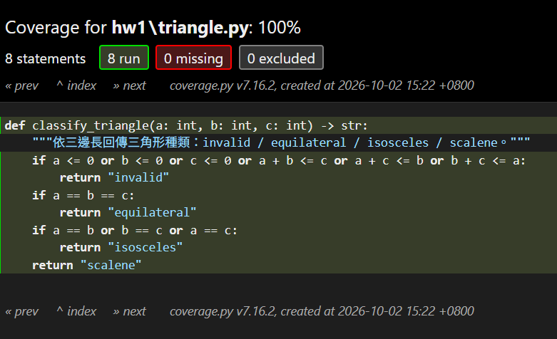

# 作業一：選定程式語言與測試工具

組別／組員：（請填寫）

| 項目 | 選定結果 |
| --- | --- |
| 程式語言 | **Python 3.14** |
| 測試工具 | **pytest 9.1.1**，搭配外掛 **pytest-cov 7.1.0**（涵蓋率引擎為 **coverage.py 7.16.2**） |
| 測試目標 | 每個作業的指定涵蓋率準則達到 **100%**，且使用**最少個測試案例** |

---

## 1. 程式語言：Python

- 語法精簡，待測程式與測試程式都短，方便逐行分析涵蓋率、推導最少測試案例。
- 不需編譯，修改後可立即重新執行測試並看到涵蓋率變化。
- 測試與涵蓋率工具成熟、免費、跨平台（Windows / macOS / Linux 皆可用），組員環境容易統一。

## 2. 測試工具：pytest + pytest-cov

### (i) 測試工具的介紹

**pytest** 是 Python 最廣泛使用的開源測試框架（MIT 授權），由 pytest-dev 社群維護。它用一般的函式與 Python 內建的 `assert` 寫測試，不必繼承類別或記憶大量 `assertEqual` 類的方法，適合撰寫單元測試（Unit Testing）。

**pytest-cov** 是 pytest-dev 社群維護的官方外掛，把 **coverage.py** 整合進 pytest。執行測試時，coverage.py 透過 Python 直譯器的追蹤機制記錄「哪些行被執行過」，再與原始碼分析出的「可執行敘述」比對，計算出 Line Coverage 並列出未被執行的行號。

兩者合用，一個指令就能同時完成「執行單元測試」與「產生 Line Coverage 統計」：

```text
pytest hw1 --cov --cov-report=term-missing
```

| 作業要求 | 對應的工具功能 |
| --- | --- |
| 支援 Unit Testing | pytest：測試探索、`assert`、參數化測試、fixture 等 |
| 支援 Line Coverage 統計資料 | pytest-cov / coverage.py：`Stmts`、`Miss`、`Cover`、`Missing` 欄位 |

### (ii) 測試工具功能的說明

#### A. 單元測試功能（pytest）

| 功能 | 說明 | 用法 |
| --- | --- | --- |
| 自動探索測試 | 自動找出 `test_*.py` 檔案中以 `test_` 開頭的函式並執行 | `pytest hw1` |
| 原生 `assert` | 斷言失敗時會顯示實際值與預期值，方便除錯 | `assert f(x) == 3` |
| 參數化測試 | 一個測試函式搭配一張「輸入／預期輸出」表，每列是一個獨立回報的測試案例；很適合列出最少測試案例集合 | `@pytest.mark.parametrize` |
| 例外測試 | 驗證程式在特定輸入下拋出指定例外 | `with pytest.raises(ValueError):` |
| Fixture | 共用的前置／清除程序（如建立測試資料），可在多個測試間重用 | `@pytest.fixture` |
| 篩選與標記 | 只執行部分測試，或標記為略過／預期失敗 | `-k`、`-m`、`skip`、`xfail` |
| 結果報表 | 顯示每個測試案例的通過／失敗 | `-v`（詳細）、`-q`（精簡） |

#### B. 涵蓋率功能（pytest-cov / coverage.py）

| 功能 | 說明 | 用法 |
| --- | --- | --- |
| **Line Coverage** | 統計每個檔案的可執行敘述數 `Stmts`、未執行數 `Miss`，以及涵蓋率 `Cover = (Stmts − Miss) / Stmts` | `--cov` |
| 列出未涵蓋的行 | `Missing` 欄位列出沒被執行到的行號，據此補測試案例 | `--cov-report=term-missing` |
| 門檻檢查 | 涵蓋率未達門檻時，整體測試結果判定為失敗 | `--cov-fail-under=100` |
| Branch Coverage | 加上 `Branch`（分支數）與 `BrPart`（只走過一邊的分支數）欄位，後續作業可用 | `--cov-branch` |
| HTML 報表 | 產生 `htmlcov/index.html`，以顏色標示每一行是否被執行 | `--cov-report=html` |
| 其他報表格式 | XML / JSON / LCOV，可供 CI 或其他工具讀取 | `--cov-report=xml` 等 |
| 排除特定程式碼 | 以 `# pragma: no cover` 排除不列入統計的行（本組**不會**用它來規避未涵蓋的程式碼） | 註解標記 |

**限制：** coverage.py 的 Branch Coverage 只看「從某一行跳到哪一行」，不會分別檢查複合條件（如 `a <= 0 or b <= 0`）裡每個子條件的真假。因此遇到 Condition Coverage、MC/DC 等準則時，須自行分析條件並設計測試案例，工具的數字只能當作輔助。

本專案在 [pyproject.toml](../pyproject.toml) 中設定執行 `pytest` 時一律產生 Line Coverage 報表，並把門檻設為 100%，未達 100% 即判定失敗：

```toml
[tool.pytest.ini_options]
addopts = "--cov --cov-report=term-missing"

[tool.coverage.run]
source = ["."]
omit = ["*/test_*.py", ".venv/*"]   # 測試程式本身不列入涵蓋率

[tool.coverage.report]
fail_under = 100
```

## 3. 示範：以最少測試案例達到 100% Line Coverage

### 待測程式 [triangle.py](triangle.py)

```python
1  def classify_triangle(a: int, b: int, c: int) -> str:
2      """依三邊長回傳三角形種類：invalid / equilateral / isosceles / scalene。"""
3      if a <= 0 or b <= 0 or c <= 0 or a + b <= c or a + c <= b or b + c <= a:
4          return "invalid"
5      if a == b == c:
6          return "equilateral"
7      if a == b or b == c or a == c:
8          return "isosceles"
9      return "scalene"
```

### 最少測試案例數的推導

- coverage.py 統計的可執行敘述共 8 個（第 1、3–9 行；第 2 行 docstring 不計入）。
- 第 4、6、8、9 行是 4 個 `return`，每次呼叫只會執行其中一個就結束，所以**至少需要 4 個測試案例**。
- 下表 4 個案例各涵蓋一個不同的 `return`，第 3、5、7 行也會順帶被執行；第 1 行在載入模組時就會執行。4 個案例即可達到 100%，所以 **4 是最少案例數**。

| 案例 | 輸入 (a, b, c) | 預期輸出 | 執行的行 |
| --- | --- | --- | --- |
| T1 | (1, 1, 3) | `invalid` | 3, 4 |
| T2 | (2, 2, 2) | `equilateral` | 3, 5, 6 |
| T3 | (2, 2, 3) | `isosceles` | 3, 5, 7, 8 |
| T4 | (3, 4, 5) | `scalene` | 3, 5, 7, 9 |

測試程式 [test_triangle.py](test_triangle.py) 用參數化測試把上表寫成一個測試函式：

```python
@pytest.mark.parametrize(
    ("a", "b", "c", "expected"),
    [
        (1, 1, 3, "invalid"),      # line 4
        (2, 2, 2, "equilateral"),  # line 6
        (2, 2, 3, "isosceles"),    # line 8
        (3, 4, 5, "scalene"),      # line 9
    ],
)
def test_classify_triangle(a, b, c, expected):
    assert classify_triangle(a, b, c) == expected
```

### 執行結果：4 個案例，Line Coverage 100%

```text
> pytest hw1 -v
hw1/test_triangle.py::test_classify_triangle[1-1-3-invalid] PASSED       [ 25%]
hw1/test_triangle.py::test_classify_triangle[2-2-2-equilateral] PASSED   [ 50%]
hw1/test_triangle.py::test_classify_triangle[2-2-3-isosceles] PASSED     [ 75%]
hw1/test_triangle.py::test_classify_triangle[3-4-5-scalene] PASSED       [100%]

Name              Stmts   Miss  Cover   Missing
-----------------------------------------------
hw1\triangle.py       8      0   100%
-----------------------------------------------
TOTAL                 8      0   100%
Required test coverage of 100.0% reached. Total coverage: 100.00%
============================== 4 passed in 0.18s ==============================
```


### 對照：少一個案例就無法達到 100%

拿掉 T4 後，`Missing` 欄位指出第 9 行沒被執行，涵蓋率降為 88%，門檻檢查判定失敗。拿掉其他任一案例也一樣會漏掉對應的 `return` 行，證明 4 個案例缺一不可。

```text
> pytest hw1 -q -k "not scalene"
Name              Stmts   Miss  Cover   Missing
-----------------------------------------------
hw1\triangle.py       8      1    88%   9
-----------------------------------------------
TOTAL                 8      1    88%
FAIL Required test coverage of 100.0% not reached. Total coverage: 87.50%
3 passed, 1 deselected in 0.07s
```

## 4. 環境建置與執行方式

在專案根目錄（Windows PowerShell）：

```powershell
python -m venv .venv
.venv\Scripts\python -m pip install -r requirements.txt
.venv\Scripts\python -m pytest hw1 -v
```

- 加上 `--cov-branch` 可同時看到 Branch Coverage。
- 加上 `--cov-report=html` 會產生 `htmlcov/index.html`，可用瀏覽器查看逐行標色的報表。
